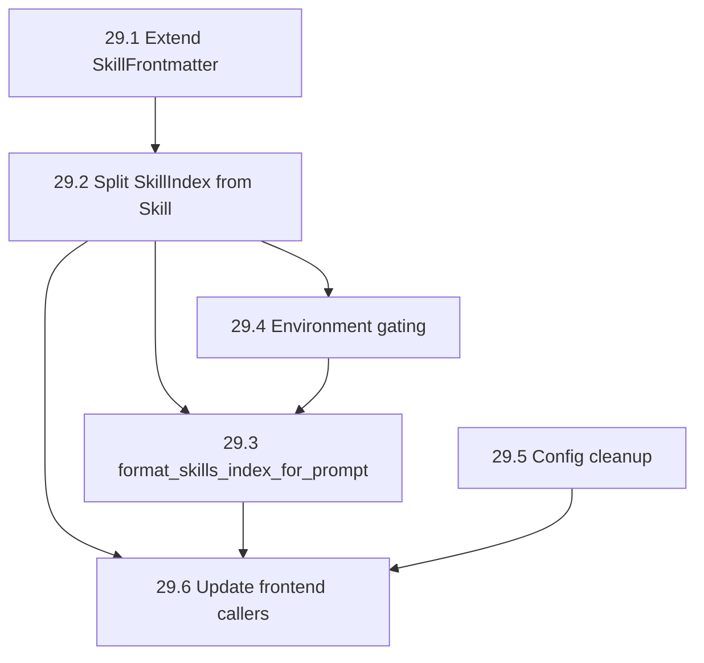

# EPIC-29: Core Skills Infrastructure — Index, Lazy-Load, Gating

**§SPEC:** §5 (System Prompt), §32 (Config)
**Labels:** `epic/skills`, `epic/runtime`, `epic/config`
**Crates:** `duga-runtime`, `duga-config`

## Goal

Build the core skills infrastructure in `duga-runtime` that all frontends (CLI, TUI, Telegram) share. This epic covers the data model, filesystem discovery, metadata-only parsing, lazy body loading, environment gating, and public API. It does NOT include tooling (`install-skill`, `list-skills`) or Telegram-specific wiring — those belong to EPIC-30.

The key architectural change: separate **metadata** (always loaded, ~150 chars/skill) from **body** (loaded on demand via `read` tool, ~2-10KB/skill). This saves ~14x context tokens compared to the current eager-load approach.

## Motivation

- **Token savings**: 55 skills × 2KB bodies = ~110KB in system prompt → ~8KB index (14x reduction)
- **Frontend-agnostic**: CLI, TUI, and Telegram all use the same `discover_skills()` / `load_skill_body()` / `gate_skill()` API
- **Environment awareness**: Gating prevents the LLM from trying to use skills whose dependencies aren't installed
- **Config consistency**: `skills_dir` field is currently dead code — remove it
- **Extensible frontmatter**: New `requires` and `disable_model_invocation` fields enable gating and invocation control

## Data Model Architecture

| Struct | Loads when | Size | In system prompt |
|---|---|---|---|
| `SkillIndex` | Session start (`discover_skills`) | ~150 chars each | ✅ (names + descriptions + availability) |
| `Skill` | LLM calls `read` on SKILL.md | ~2-10KB | ❌ (in conversation history, auto-expires) |

## Public API (duga-runtime)

```rust
/// Scan directories, return metadata-only index. Fast — no body I/O.
pub fn discover_skills(
    global_base: &Path,
    channel_base: Option<&Path>,
) -> Result<Vec<SkillIndex>>;

/// Load full body for a specific skill. Called when LLM reads the SKILL.md.
pub fn load_skill_body(index: &SkillIndex) -> Result<Skill>;

/// Check environment prerequisites.
pub fn gate_skill(index: &SkillIndex) -> SkillGate;

/// Format index for system prompt injection (compact markdown list).
pub fn format_skills_index_for_prompt(indexes: &[SkillIndex]) -> String;

/// Legacy: eager-load everything (body included). Kept for backward compat.
pub fn load_skills(global_base: &Path, channel_base: Option<&Path>) -> Result<Vec<Skill>>;
pub fn format_skills_for_prompt(skills: &[Skill]) -> String;
```

## Frontmatter Schema

```yaml
name: code-review                # Must match directory name, [a-z0-9-]+, ≤64 chars
description: Review code changes  # Required, ≤1024 chars
requires:                        # Optional — environment gating
  bins: [rg, git]                # Must exist on PATH
  env:                           # Env vars to inject
    GITHUB_TOKEN: "${GITHUB_TOKEN}"
disable-model-invocation: false  # If true, only usable via explicit invocation
```

## Execution Flow (frontend-agnostic)

```
Session start → discover_skills(global_base, channel_base) → Vec<SkillIndex>
                        │
                        ▼
              format_skills_index_for_prompt() → injected into system prompt
                        │
                        ▼
User asks task matching a skill → LLM calls read <path>/SKILL.md
                        │
                        ▼
              read tool returns full body → LLM follows instructions
                        │
                        ▼
              Body naturally expires as context window advances
```

---

## Implementation Plan

### TASK-29.1: Extend `SkillFrontmatter` with `requires` and `disable_model_invocation`

- **Labels:** `layer/runtime`, `priority/high`
- **Description:** Extend the existing `SkillFrontmatter` struct (currently only `name` + `description`) with two new optional sections: `requires` (bins + env) and `disable_model_invocation`. These are parsed from SKILL.md YAML frontmatter but NOT yet acted upon — that comes in later tasks.
- **Files affected:**
  - `crates/duga-runtime/src/skills.rs`
- **Types involved:**
  - `SkillFrontmatter` — add `requires: Option<SkillRequires>`, `disable_model_invocation: Option<bool>`
  - `SkillRequires` (new) — `{ bins: Option<Vec<String>>, env: Option<HashMap<String, String>> }`
- **Implementation steps:**
  1. Define `SkillRequires` struct with `#[derive(Deserialize)]`
  2. Add fields to `SkillFrontmatter`
  3. Update `extract_frontmatter()` — already serde-based, just add fields
  4. Add unit test: parse frontmatter with all new fields
  5. Add unit test: parse frontmatter without new fields (backward compat)
- **Definition of Done:** `SkillFrontmatter` carries `requires` and `disable_model_invocation`. Existing tests still pass.
- **Acceptance criteria:**
  - SKILL.md with `requires: { bins: [rg] }` → `frontmatter.requires.unwrap().bins == ["rg"]`
  - SKILL.md without `requires` → `frontmatter.requires.is_none()`
  - SKILL.md without `disable_model_invocation` → `frontmatter.disable_model_invocation.is_none()`
- **Estimated effort:** 1 hour

### TASK-29.2: Split `SkillIndex` from `Skill` — metadata-only discovery

- **Labels:** `layer/runtime`, `priority/high`
- **Description:** The core architectural change. Create a lightweight `SkillIndex` struct (name, description, location, source, requires, disable flag) and a `discover_skills()` function that scans directories and parses ONLY the YAML frontmatter — skipping the markdown body. Keep the existing `Skill` struct but make it wrap a `SkillIndex` + body. Add `load_skill_body()` for on-demand full loading.
- **Files affected:**
  - `crates/duga-runtime/src/skills.rs`
- **Types involved:**
  - `SkillIndex` (new) — lightweight metadata
  - `Skill` — refactored to `{ index: SkillIndex, body: String, base_dir: PathBuf }`
  - `SkillSource` — unchanged
- **Functions to implement:**
  - `discover_skills(global_base, channel_base) -> Result<Vec<SkillIndex>>`
  - `parse_index_only(skill_dir, source) -> Option<SkillIndex>`
  - `load_skill_body(index) -> Result<Skill>`
  - `load_skills()` — refactored to use `discover_skills()` + `load_skill_body()` internally
- **Implementation steps:**
  1. Define `SkillIndex` struct with all metadata fields
  2. Implement `parse_index_only()` — reads SKILL.md, calls `extract_frontmatter()`, discards body
  3. Implement `discover_skills()` — iterates global then channel dirs, uses `parse_index_only()`, resolves collisions via HashMap
  4. Refactor `Skill` to hold `index: SkillIndex` instead of flat fields
  5. Implement `load_skill_body()` — reads full file, resolves `{baseDir}`, returns `Skill`
  6. Refactor `load_skills()` — calls `discover_skills()` then `load_skill_body()` for each
  7. Update all existing tests (they use `load_skills()`, which still works)
  8. Add tests: `discover_skills()` returns only metadata (no body in memory)
  9. Add tests: `load_skill_body()` resolves `{baseDir}` correctly
- **Definition of Done:** `discover_skills()` returns `Vec<SkillIndex>` in <10ms for 55 skills. `load_skill_body()` works on demand. Existing API unchanged.
- **Acceptance criteria:**
  - 55 skills discovered in <10ms (no body I/O in metadata path)
  - `SkillIndex.description` populated from frontmatter
  - `load_skill_body()` returns body with `{baseDir}` resolved to absolute path
  - Channel skills shadow global in index (by name)
  - Existing callers of `load_skills()` + `format_skills_for_prompt()` still work
- **Estimated effort:** 5 hours

### TASK-29.3: `format_skills_index_for_prompt()` — compact markdown list

- **Labels:** `layer/runtime`, `priority/high`
- **Description:** Add a new formatting function that outputs only the metadata index (names, descriptions, availability) as a compact markdown list. This replaces `format_skills_for_prompt()` for system prompt injection — the old function is kept for backward compat. The system prompt tells the LLM to use `read` to load full skill instructions on demand.
- **Files affected:**
  - `crates/duga-runtime/src/skills.rs`
- **Functions to implement:**
  - `format_skills_index_for_prompt(indexes: &[SkillIndex]) -> String`
- **Output format:**
  ```
  ## Available Skills
  
  - **code-review**: Review code changes for correctness and security
  - **vinted-scraper**: Search Vinted listings and extract prices
  - **instagram-download**: Download Instagram posts ⚠️ unavailable: missing yt-dlp
  
  When a task matches a skill's description, use `read` to load its
  full instructions from the skill's SKILL.md file.
  ```
- **Implementation steps:**
  1. Implement `format_skills_index_for_prompt()`
  2. Skip skills with `disable_model_invocation: true`
  3. Add `⚠️ unavailable: missing <bins/env>` for gated-out skills (gating function from 29.4)
  4. Include usage instruction telling LLM to use `read`
  5. Add tests: empty index → empty string, index with skills → markdown list
- **Definition of Done:** Function produces ~150 chars/skill instead of ~2KB/skill.
- **Acceptance criteria:**
  - 55 skills → output ~8KB (was ~110KB with bodies)
  - Disabled skills excluded from output
  - Usage instruction present
- **Estimated effort:** 1.5 hours

### TASK-29.4: Environment gating — `SkillGate` validation

- **Labels:** `layer/runtime`, `priority/medium`
- **Description:** Implement `gate_skill(index) -> SkillGate` that checks whether a skill's environment prerequisites are met. Verifies `requires.bins` exist on PATH and `requires.env` template variables resolve. Unavailable skills still appear in the index but with a `⚠️` marker. The gating runs at discovery time so the system prompt reflects current environment state.
- **Files affected:**
  - `crates/duga-runtime/src/skills.rs`
- **Types involved:**
  - `SkillGate { available: bool, missing_bins: Vec<String>, missing_env: Vec<String> }`
- **Implementation steps:**
  1. Define `SkillGate` struct
  2. Implement `gate_skill(index: &SkillIndex) -> SkillGate`
  3. Use `which::which()` for binary checks (already in dependency tree via sandbox)
  4. Check env var template references: `"${GITHUB_TOKEN}"` → verify `std::env::var("GITHUB_TOKEN").is_ok()`
  5. Integrate into `discover_skills()` — store gate result in `SkillIndex` (add `gate: SkillGate` field)
  6. Add test: skill requiring `nonexistent-bin-xyz` → `available: false`, `missing_bins: ["nonexistent-bin-xyz"]`
  7. Add test: skill requiring `HOME` → `available: true` (HOME always set)
- **Definition of Done:** Skills with missing dependencies show as unavailable. Skills with all deps show as available.
- **Acceptance criteria:**
  - Skill requiring `rg` → available if `rg` on PATH, unavailable otherwise
  - Skill requiring `GITHUB_TOKEN` → available if env var set, unavailable otherwise
  - Missing deps listed in system prompt with `⚠️` via `format_skills_index_for_prompt()`
  - Skill with no `requires` field → always available
- **Estimated effort:** 2 hours

### TASK-29.5: Config cleanup — remove dead `skills_dir` field

- **Labels:** `layer/config`, `priority/low`
- **Description:** The `telegram.skills_dir` config field is defined in `TelegramConfig` but never read by the runtime. The skills base path is hardcoded in callers. Remove the field entirely — frontends derive the skills path from their own conventions (`data_dir` for Telegram, `workspace.root` for CLI). This keeps config surface minimal and avoids the dead field confusing users.
- **Files affected:**
  - `crates/duga-config/src/config.rs`
  - `duga-deepseek.yaml`
- **Implementation steps:**
  1. Remove `skills_dir` field from `TelegramConfig`
  2. Remove `default_telegram_skills_dir()` function
  3. Remove `#[serde(default = "default_telegram_skills_dir")]` annotation
  4. Remove `skills_dir: "./skills"` from `duga-deepseek.yaml`
  5. Update `TelegramConfig::default()` impl
  6. Verify: `grep -rn "skills_dir" crates/` returns only test code or comments
  7. Run full test suite
- **Definition of Done:** No dead config field. Compiles cleanly. Tests pass.
- **Acceptance criteria:**
  - `duga-deepseek.yaml` no longer has `skills_dir` entry
  - `TelegramConfig` no longer has `skills_dir` field
  - `cargo test -p duga-config` passes
- **Estimated effort:** 0.5 hours

### TASK-29.6: Update `build_agent` and frontend callers to use new API

- **Labels:** `layer/runtime`, `priority/medium`
- **Description:** Update `duga-runtime/src/agent.rs` and all frontend callers (CLI harness, Telegram runtime) to use the new `discover_skills()` + `format_skills_index_for_prompt()` API instead of the old `load_skills()` + `format_skills_for_prompt()`. The old functions remain available for backward compat. This is the final wiring step for the core epic.
- **Files affected:**
  - `crates/duga-runtime/src/agent.rs` (optional — build_agent already supports caller-provided system prompt)
  - `crates/duga-telegram-bot/src/runtime.rs`
  - `crates/duga-harness/src/cli.rs` (if CLI uses skills)
- **Implementation steps:**
  1. In each frontend's task-run function, replace:
     ```rust
     let skills = load_skills(&base, Some(&channel))?;
     let skills_prompt = format_skills_for_prompt(&skills);
     ```
     with:
     ```rust
     let indexes = discover_skills(&base, Some(&channel))?;
     let skills_prompt = format_skills_index_for_prompt(&indexes);
     ```
  2. Update any tests that assert on the old format
  3. Verify system prompt size reduction in logs
- **Definition of Done:** All frontends use the lazy-load API. System prompt contains index only.
- **Acceptance criteria:**
  - Telegram bot system prompt contains skill index (~8KB), not full bodies (~110KB)
  - CLI harness uses same API
  - Old `load_skills()` + `format_skills_for_prompt()` still compile and pass tests
- **Estimated effort:** 2 hours

---

## Dependency Graph



| Task | Depends on | Blocks |
|---|---|---|
| 29.1 Extend SkillFrontmatter | — | 29.2 |
| 29.2 Split SkillIndex from Skill | 29.1 | 29.3, 29.4, 29.6 |
| 29.3 format_skills_index_for_prompt | 29.2, 29.4 | 29.6 |
| 29.4 Environment gating | 29.2 | 29.3 |
| 29.5 Config cleanup | — | 29.6 |
| 29.6 Update frontend callers | 29.2, 29.3, 29.5 | EPIC-30 |

## Effort Summary

| Task | Hours |
|---|---|
| 29.1 Extend SkillFrontmatter | 1 |
| 29.2 Split SkillIndex from Skill | 5 |
| 29.3 format_skills_index_for_prompt | 1.5 |
| 29.4 Environment gating | 2 |
| 29.5 Config cleanup | 0.5 |
| 29.6 Update frontend callers | 2 |
| **Total** | **12** |
