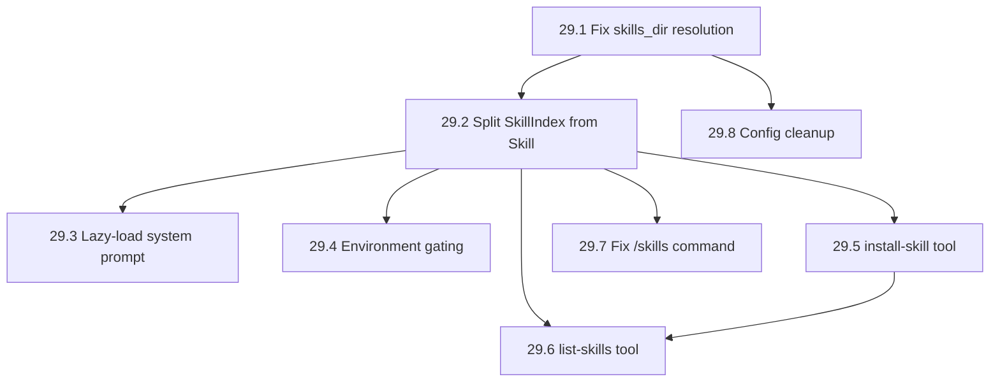

# EPIC-29: Skills System — Lazy-Loading, Gating, and Tooling

**§SPEC:** §5 (System Prompt), §11 (Built-in Tools), §24 (Telegram Rendering), §32 (Config)
**Labels:** `epic/skills`, `epic/telegram`, `epic/tools`, `epic/runtime`
**Crates:** `duga-runtime`, `duga-tools-builtin`, `duga-telegram-bot`, `duga-config`

## Goal

Implement a structured, scalable Skills system with dual-layer storage (Global + Channel-local), lazy-loading to save context window tokens, environment gating to verify prerequisites, and dedicated tooling for install/list/remove operations.

Currently skills are loaded **eagerly** — all SKILL.md body content is dumped into the system prompt at session start. With 55+ skills, this wastes ~110KB of context tokens. The LLM also has no tooling to install or discover skills; it must manually `mkdir` + `write` with correct YAML frontmatter format.

## Motivation

- **Token savings**: 55 skills × 2KB bodies = ~110KB in system prompt → replaced with ~8KB index (14x reduction)
- **Reliable installation**: `install-skill` tool validates frontmatter, creates correct directory structure, sets permissions
- **Discoverability**: `list-skills` lets the LLM check what's installed mid-conversation
- **Environment awareness**: Gating prevents the LLM from trying to use skills whose dependencies aren't installed
- **Config consistency**: `skills_dir` field is currently dead code — make it work or remove it
- **Channel isolation**: Channel-level skills shadow global ones, matching pi-mom-telegram's pattern

## Directory Layout

```
data/                              ← config.telegram.data_dir
├── skills/                        ← GLOBAL: shared across all chats
│   └── <name>/
│       └── SKILL.md
├── <chat_id>/
│   └── skills/                    ← LOCAL: overrides global on name collision
│       └── <name>/
│           └── SKILL.md
```

## Frontmatter Schema

```yaml
name: code-review                # Must match directory name, [a-z0-9-]+, ≤64 chars
description: Review code changes  # Required, ≤1024 chars
requires:                        # Optional — environment gating
  bins: [rg, git]                # Must exist on PATH
  env:                           # Env vars to inject
    GITHUB_TOKEN: "${GITHUB_TOKEN}"
disable-model-invocation: false  # If true, only usable via explicit invocation
```

## Data Model Architecture

| Struct | Loads when | Size | In system prompt |
|---|---|---|---|
| `SkillIndex` | Session start | ~150 chars each | ✅ (names + descriptions only) |
| `Skill` | LLM calls `read skills/<name>/SKILL.md` | ~2-10KB | ❌ (in conversation history) |

## Execution Flow

```
Session start → discover_skills() → SkillIndex[] → inject into system prompt
                                                      ↓
User asks task matching a skill → LLM calls read skills/<name>/SKILL.md
                                                      ↓
                                  read tool returns full body → LLM follows instructions
                                                      ↓
                                  Body naturally expires as context window advances
```

---

## Implementation Plan

### TASK-29.1: Fix `skills_dir` resolution — use `data_dir`, not `workspace.root`

- **Labels:** `layer/runtime`, `priority/high`
- **Description:** The Telegram runtime currently passes `workspace.root` as the global skills base path. This means it looks for skills at `~/duga-workspace/skills/` which doesn't exist. Fix it to use `telegram_config.data_dir` (i.e. `./data`) so global skills resolve to `data/skills/` and channel skills to `data/<chat_id>/skills/`. Also auto-create the skills directory on startup.
- **Files affected:**
  - `crates/duga-telegram-bot/src/runtime.rs`
- **Types involved:** `TelegramConfig`
- **Implementation steps:**
  1. In `run_task_for_chat`, change `load_skills(&self.config.workspace.root, ...)` to `load_skills(&telegram_config.data_dir, ...)`
  2. Add `tokio::fs::create_dir_all(data_dir.join("skills")).await?` before skill loading
  3. Verify channel skills resolve to `data/<chat_id>/skills/` (already correct via `chat_dir`)
- **Definition of Done:** Global skills load from `data/skills/`, channel skills from `data/<chat_id>/skills/`. Skills directory auto-created on first run.
- **Acceptance criteria:**
  - Bot picks up skills placed in `data/skills/` without workspace involvement
  - `data/skills/` directory created automatically if missing
  - Channel-level skills at `data/<chat_id>/skills/` shadow global ones
- **Estimated effort:** 1 hour

### TASK-29.2: Split `SkillIndex` from `Skill` — metadata-only parse

- **Labels:** `layer/runtime`, `priority/high`
- **Description:** Refactor `skills.rs` to separate metadata (always loaded) from body (loaded on demand). Add a `SkillIndex` struct containing name, description, location path, source, required bins, required env vars, and disable flag. Add `parse_index_only()` that reads only the YAML frontmatter without the markdown body. Keep `load_skill_body()` for full loading when the LLM needs it.
- **Files affected:**
  - `crates/duga-runtime/src/skills.rs`
- **Types involved:**
  - `SkillIndex` (new) — lightweight metadata
  - `SkillFrontmatter` — extended with `requires` and `disable_model_invocation` fields
  - `SkillRequires` (new) — `{ bins: Option<Vec<String>>, env: Option<HashMap<String, String>> }`
  - `Skill` — now wraps a `SkillIndex` + body
- **Implementation steps:**
  1. Define `SkillIndex`, `SkillRequires` structs
  2. Extend `SkillFrontmatter` with `requires: Option<SkillRequires>` and `disable_model_invocation: Option<bool>`
  3. Implement `discover_skills(global_base, channel_base) -> Vec<SkillIndex>` — scans directories, calls `parse_index_only()`, resolves collisions
  4. Implement `parse_index_only(skill_dir, source) -> Option<SkillIndex>` — reads only frontmatter
  5. Implement `load_skill_body(index) -> Result<Skill>` — reads full SKILL.md, resolves `{baseDir}`
  6. Update existing tests, add tests for index-only parse
- **Definition of Done:** `discover_skills()` returns `Vec<SkillIndex>` without loading bodies. `load_skill_body()` works for on-demand loading.
- **Acceptance criteria:**
  - 55 skills discovered in <10ms (no body I/O)
  - `SkillIndex.description` populated correctly from frontmatter
  - `load_skill_body()` returns body with `{baseDir}` resolved
  - Channel skills shadow global in index (by name)
- **Estimated effort:** 4 hours

### TASK-29.3: Lazy-load system prompt — inject index, not bodies

- **Labels:** `layer/runtime`, `priority/high`
- **Description:** Replace `format_skills_for_prompt(skills)` (which dumps full bodies) with a new function that injects only the metadata index. The system prompt lists skill names, descriptions, and tells the LLM to use `read` to load the full instructions when needed.
- **Files affected:**
  - `crates/duga-runtime/src/skills.rs`
  - `crates/duga-telegram-bot/src/runtime.rs`
  - `crates/duga-runtime/src/agent.rs`
- **Implementation steps:**
  1. Add `format_skills_index_for_prompt(indexes: &[SkillIndex]) -> String` — outputs compact markdown list
  2. Update `run_task_for_chat` to call `discover_skills()` + `format_skills_index_for_prompt()` instead of `load_skills()` + `format_skills_for_prompt()`
  3. Update system prompt instructions to tell LLM: "When a task matches a skill's description, use `read` to load its full instructions"
  4. Keep `load_skills()` and `format_skills_for_prompt()` for backward compat / tests
- **Definition of Done:** System prompt contains ~150 chars per skill instead of ~2KB. LLM uses `read` tool to load skill bodies on demand.
- **Acceptance criteria:**
  - 55 skills → system prompt ~8KB (was ~110KB)
  - LLM successfully follows skill instructions after `read`ing the SKILL.md
  - Skills without `disable_model_invocation` appear in the prompt
  - Gated-out skills show `⚠️ unavailable: missing <bins>`
- **Estimated effort:** 3 hours

### TASK-29.4: Environment gating — `SkillGate` validation

- **Labels:** `layer/runtime`, `priority/medium`
- **Description:** Before marking a skill as available, verify that its `requires.bins` exist on PATH and `requires.env` template variables resolve. Add a `gate_skill(index) -> SkillGate` function that returns availability status with details about what's missing. Unavailable skills still appear in the index but with a warning marker.
- **Files affected:**
  - `crates/duga-runtime/src/skills.rs`
- **Types involved:** `SkillGate { available: bool, missing_bins: Vec<String>, missing_env: Vec<String> }`
- **Implementation steps:**
  1. Define `SkillGate` struct
  2. Implement `gate_skill(index: &SkillIndex) -> SkillGate`
  3. Use `which::which()` to check bins (already in dependency tree via sandbox)
  4. Check env var template references resolve against `std::env::var()`
  5. Integrate into `format_skills_index_for_prompt()` — add `⚠️` markers
  6. Add test: skill requiring `nonexistent-bin` returns `available: false`
- **Definition of Done:** Skills with missing dependencies show as unavailable in the prompt. Skills with all deps show as available.
- **Acceptance criteria:**
  - Skill requiring `rg` → available if `rg` on PATH, unavailable otherwise
  - Skill requiring `GITHUB_TOKEN` → available if env var set, unavailable otherwise
  - Missing deps listed in system prompt with `⚠️`
- **Estimated effort:** 2 hours

### TASK-29.5: `install-skill` tool — validated skill creation

- **Labels:** `layer/tools`, `priority/medium`
- **Description:** Implement a new built-in tool `install-skill` that creates a skill directory, writes a validated SKILL.md with proper YAML frontmatter, and optional auxiliary files. Validates name format, description presence/length, and prevents path escaping in auxiliary file paths.
- **Files affected:**
  - `crates/duga-tools-builtin/src/skill_install.rs` (new)
  - `crates/duga-tools-builtin/src/lib.rs` (register)
  - `crates/duga-runtime/src/tools.rs` (register in dispatcher)
- **Types involved:**
  - `InstallSkillArgs { target: SkillTarget, channel_id: Option<String>, name: String, description: String, body: String, files: Option<Vec<SkillFile>> }`
  - `SkillTarget { Global, Channel }`
  - `SkillFile { path: String, content: String }`
- **Implementation steps:**
  1. Define `InstallSkillArgs`, `SkillTarget`, `SkillFile` with `JsonSchema` derive
  2. Implement `InstallSkillTool` with constructors taking global and channel base paths
  3. In `execute()`:
     a. Resolve target directory (global vs channel)
     b. Validate name: `[a-z0-9-]+`, ≤64 chars, no leading/trailing/double hyphens
     c. Validate description: non-empty, ≤1024 chars
     d. Create skill directory (via workspace for sandbox safety)
     e. Write SKILL.md with YAML frontmatter block
     f. Write auxiliary files, rejecting paths with `..` segments
     g. Return success with installed path
  4. Register in `register_builtin_tools()` or a separate registration function
  5. Add tests for validation, path escaping, overwrite behavior
- **Definition of Done:** LLM can call `install-skill` to reliably create skills without manual `mkdir`+`write`.
- **Acceptance criteria:**
  - `install-skill { target: "global", name: "my-skill", description: "Does things", body: "# My Skill\n..." }` → creates `data/skills/my-skill/SKILL.md`
  - Invalid name (uppercase, starting hyphen, too long) → clear error message
  - Auxiliary files with `..` in path → rejected
  - Existing skill → overwritten with warning
  - Channel target without `channel_id` → error
- **Estimated effort:** 5 hours

### TASK-29.6: `list-skills` tool — live skill discovery

- **Labels:** `layer/tools`, `priority/medium`
- **Description:** Implement a tool `list-skills` that re-reads the skills directories from disk and returns a formatted list of currently installed skills with their descriptions, sources, and availability. This gives the LLM a way to discover newly installed skills without waiting for the next session start.
- **Files affected:**
  - `crates/duga-tools-builtin/src/skill_list.rs` (new)
  - `crates/duga-tools-builtin/src/lib.rs` (register)
  - `crates/duga-runtime/src/tools.rs` (register in dispatcher)
- **Types involved:** `ListSkillsArgs { channel_id: Option<String> }`
- **Implementation steps:**
  1. Define `ListSkillsArgs` with optional `channel_id`
  2. Implement `ListSkillsTool` with global and channel base paths
  3. In `execute()`: call `discover_skills()`, format as markdown list
  4. Optionally show gating status: "✅ available" / "⚠️ missing: rg, git"
  5. Register in dispatcher
- **Definition of Done:** LLM can call `list-skills` anytime to see what's installed.
- **Acceptance criteria:**
  - Returns all global skills (names + descriptions)
  - With `channel_id` → also returns channel-specific skills
  - Newly installed skills appear immediately (no session restart needed)
  - Empty skills dir → "(no skills installed)"
- **Estimated effort:** 2 hours

### TASK-29.7: Fix `/skills` Telegram command

- **Labels:** `layer/telegram`, `priority/low`
- **Description:** The `/skills` command handler in `bot.rs` currently returns a hardcoded string. Update it to actually list installed skills by calling `discover_skills()` and formatting the result.
- **Files affected:**
  - `crates/duga-telegram-bot/src/bot.rs`
- **Implementation steps:**
  1. Pass `TelegramConfig` (or `data_dir`) to the command handler
  2. Call `discover_skills(&data_dir, None)` on `/skills`
  3. Format with name + description + source + availability
  4. Fall back to: "No skills installed. Ask me to install one!" if empty
- **Definition of Done:** `/skills` command returns actual skill list.
- **Acceptance criteria:**
  - `/skills` → list of available skills with descriptions
  - `/skills` when empty → helpful message suggesting installation
- **Estimated effort:** 1 hour

### TASK-29.8: Config cleanup — remove or fix `skills_dir` field

- **Labels:** `layer/config`, `priority/low`
- **Description:** The `telegram.skills_dir` config field is defined but never read by the runtime (dead code). Either wire it through so callers can override the skills path, or remove it and derive the skills path from `data_dir`. Recommendation: remove it — the convention of `data_dir/skills/` is sufficient.
- **Files affected:**
  - `crates/duga-config/src/config.rs`
  - `duga-deepseek.yaml` (remove `skills_dir: "./skills"`)
- **Implementation steps:**
  1. Remove `skills_dir` field from `TelegramConfig`
  2. Remove `default_telegram_skills_dir()` function
  3. Remove `skills_dir: "./skills"` from config YAML files
  4. Update `Default` impl for `TelegramConfig`
  5. Verify no other code references `skills_dir` (it was already unused)
- **Definition of Done:** No dead config field confusing users.
- **Acceptance criteria:**
  - `duga-deepseek.yaml` no longer has a misleading `skills_dir` entry
  - Compiles cleanly
  - Tests pass
- **Estimated effort:** 0.5 hours

---

## Dependency Graph



| Task | Depends on | Blocks |
|---|---|---|
| 29.1 Fix skills_dir resolution | — | 29.2, 29.8 |
| 29.2 Split SkillIndex from Skill | 29.1 | 29.3, 29.4, 29.5, 29.6, 29.7 |
| 29.3 Lazy-load system prompt | 29.2 | — |
| 29.4 Environment gating | 29.2 | — |
| 29.5 install-skill tool | 29.2 | 29.6 |
| 29.6 list-skills tool | 29.2, 29.5 | — |
| 29.7 Fix /skills command | 29.2 | — |
| 29.8 Config cleanup | 29.1 | — |

## Effort Summary

| Task | Hours |
|---|---|
| 29.1 Fix skills_dir resolution | 1 |
| 29.2 Split SkillIndex from Skill | 4 |
| 29.3 Lazy-load system prompt | 3 |
| 29.4 Environment gating | 2 |
| 29.5 install-skill tool | 5 |
| 29.6 list-skills tool | 2 |
| 29.7 Fix /skills command | 1 |
| 29.8 Config cleanup | 0.5 |
| **Total** | **18.5** |
