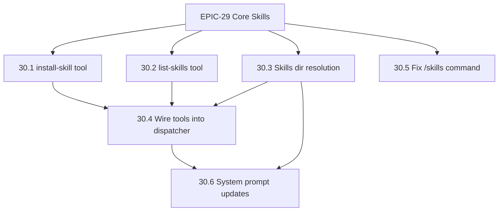

# EPIC-30: Skills Tooling & Telegram Integration

**§SPEC:** §5 (System Prompt), §11 (Built-in Tools), §24 (Telegram Rendering)
**Labels:** `epic/skills`, `epic/telegram`, `epic/tools`
**Crates:** `duga-tools-builtin`, `duga-telegram-bot`
**Depends on:** EPIC-29 (Core Skills Infrastructure)

## Goal

Build the skills tooling layer and Telegram integration on top of EPIC-29's core API. This epic covers:

- **Built-in tools** (`install-skill`, `list-skills`) — generic, take configurable paths at construction time
- **Telegram wiring** — resolve skills directories to `data_dir`, auto-create on startup, register tools with correct paths
- **`/skills` command** — live skill listing for Telegram users
- **System prompt** — Telegram-specific skill path instructions

The tools themselves live in `duga-tools-builtin` and are frontend-agnostic — they accept `global_skills_dir` and `channel_skills_base` at construction time. The Telegram runtime wires them with `data_dir`-based paths.

## Directory Layout (Telegram convention)

```
data/                              ← config.telegram.data_dir
├── skills/                        ← GLOBAL: shared across all chats
│   └── <name>/
│       ├── SKILL.md
│       └── aux files...
├── <chat_id>/
│   └── skills/                    ← LOCAL: overrides global on name collision
│       └── <name>/
│           └── SKILL.md
```

## Tools

| Tool | Signature | Description |
|---|---|---|
| `install-skill` | `{ target, channel_id?, name, description, body, files? }` | Creates skill dir + SKILL.md + aux files with validation |
| `list-skills` | `{ channel_id? }` | Re-reads from disk, returns formatted list with availability |

---

## Implementation Plan

### TASK-30.1: `install-skill` built-in tool

- **Labels:** `layer/tools`, `priority/high`
- **Description:** Implement a new built-in tool `install-skill` in `duga-tools-builtin`. The tool creates a skill directory, writes a validated SKILL.md with proper YAML frontmatter, and optional auxiliary files. It validates name format, description presence/length, and prevents path escaping in auxiliary file paths. The tool is generic — it receives `global_skills_dir` and `channel_skills_base` at construction time, making it usable by any frontend.
- **Files affected:**
  - `crates/duga-tools-builtin/src/skill_install.rs` (new)
  - `crates/duga-tools-builtin/src/lib.rs` (add module + export)
- **Types involved:**
  ```rust
  struct InstallSkillArgs {
      label: String,
      target: SkillTarget,            // "global" | "channel"
      channel_id: Option<String>,     // required when target = "channel"
      name: String,                   // [a-z0-9-]+, ≤64 chars
      description: String,            // required, ≤1024 chars
      body: String,                   // SKILL.md markdown after frontmatter
      files: Option<Vec<SkillFile>>,  // auxiliary files
  }

  enum SkillTarget { Global, Channel }

  struct SkillFile {
      path: String,      // relative to skill dir, e.g. "search.py"
      content: String,
  }
  ```
- **Functions to implement:**
  - `InstallSkillTool::new(global_skills_dir: PathBuf, channel_skills_base: PathBuf) -> Self`
  - `impl Tool for InstallSkillTool`
  - `fn validate_skill_name(name: &str) -> Result<(), String>`
  - `fn build_skill_md(name: &str, description: &str, body: &str) -> String`
- **Implementation steps:**
  1. Define `InstallSkillArgs`, `SkillTarget`, `SkillFile` with `JsonSchema` derive
  2. Implement name validation:
     - Only `[a-z0-9-]`, ≤64 chars, no leading/trailing/double hyphens
     - Return clear error messages: "name 'MySkill' contains uppercase characters"
  3. Implement description validation: non-empty, ≤1024 chars
  4. In `execute()`:
     a. Resolve target directory from `target` + optional `channel_id`
     b. Validate name and description
     c. Create skill directory via `ctx.workspace.create_dir_all()`
     d. Build SKILL.md with YAML frontmatter:
        ```yaml
        ---
        name: <name>
        description: <description>
        ---
        
        <body>
        ```
     e. Write SKILL.md via workspace (atomic write like `WriteTool`)
     f. Write auxiliary files, rejecting paths with `..` or absolute paths
     g. Return success with installed path
  5. Register in `duga-tools-builtin/src/lib.rs` (export, register in optional helper)
  6. Add tests: name validation edge cases, overwrite behavior, path escaping
- **Definition of Done:** LLM can call `install-skill` to reliably create skills.
- **Acceptance criteria:**
  - `install-skill { target: "global", name: "my-skill", description: "Does things", body: "# My Skill\n..." }` creates `skills/my-skill/SKILL.md`
  - `target: "channel"` without `channel_id` → clear error
  - Invalid name (uppercase, "---start", too long) → clear error message
  - Empty description → error "description is required"
  - Auxiliary file with `../escape.py` → rejected
  - Existing skill overwritten → success with note "(overwritten)"
  - All writes go through `ctx.workspace` (sandbox-safe)
- **Estimated effort:** 5 hours

### TASK-30.2: `list-skills` built-in tool

- **Labels:** `layer/tools`, `priority/medium`
- **Description:** Implement `list-skills` tool that calls `duga_runtime::discover_skills()` and formats the result as a readable markdown list. The tool re-reads from disk each time, so newly installed skills appear immediately without session restart. Accepts optional `channel_id` to include channel-level skills.
- **Files affected:**
  - `crates/duga-tools-builtin/src/skill_list.rs` (new)
  - `crates/duga-tools-builtin/src/lib.rs` (add module + export)
- **Types involved:**
  ```rust
  struct ListSkillsArgs {
      label: String,
      channel_id: Option<String>,
  }
  ```
- **Implementation steps:**
  1. Define `ListSkillsArgs` with `JsonSchema`
  2. Implement `ListSkillsTool::new(global_skills_dir: PathBuf, channel_skills_base: PathBuf) -> Self`
  3. In `execute()`:
     a. Resolve channel skills dir if `channel_id` provided
     b. Call `duga_runtime::skills::discover_skills(&global_dir, channel_dir)`
     c. Call `gate_skill()` for each index to get availability
     d. Format output:
        ```
        ## Installed Skills (3 global)
        
        - **code-review** ✅ — Review code changes for correctness and security
        - **vinted-scraper** ✅ — Search Vinted listings and extract prices  
        - **instagram-download** ⚠️ — Download Instagram posts (missing: yt-dlp)
        ```
     e. Handle empty: "(no skills installed)"
  4. Add tests: empty dirs, mixed global+channel, gating markers
- **Definition of Done:** LLM can call `list-skills` anytime to see what's installed.
- **Acceptance criteria:**
  - Returns all global skills with names, descriptions, availability
  - With `channel_id` → also returns channel-specific skills, marked with source
  - Newly installed skills appear immediately (reads from disk, not cache)
  - Empty skills dir → "(no skills installed)"
- **Estimated effort:** 2 hours

### TASK-30.3: Skills directory resolution + auto-create (Telegram)

- **Labels:** `layer/telegram`, `priority/high`
- **Description:** Update the Telegram runtime to resolve skills directories to `data_dir`-based paths and auto-create them on startup. Global skills at `data/skills/`, channel skills at `data/<chat_id>/skills/`. This replaces the current incorrect path `workspace.root/skills/`.
- **Files affected:**
  - `crates/duga-telegram-bot/src/runtime.rs`
- **Implementation steps:**
  1. Add before skill loading:
     ```rust
     let global_skills_dir = telegram_config.data_dir.join("skills");
     tokio::fs::create_dir_all(&global_skills_dir).await?;
     ```
  2. Pass `&telegram_config.data_dir` as the global base to `discover_skills()`
  3. Pass `&chat_dir` as the channel base (already correct: `data/<id>/`)
  4. Verify: channel skills shadow global (already handled by `discover_skills()`)
  5. Remove any remaining references to `workspace.root` for skill paths
- **Definition of Done:** Global skills load from `data/skills/`, channel skills from `data/<chat_id>/skills/`. Directories auto-created.
- **Acceptance criteria:**
  - Skills placed in `data/skills/` appear in system prompt
  - `data/skills/` auto-created on first bot run
  - Channel-level skills at `data/<chat_id>/skills/` shadow global ones
- **Estimated effort:** 1 hour

### TASK-30.4: Wire skill tools into Telegram dispatcher

- **Labels:** `layer/telegram`, `priority/high`
- **Description:** Register `install-skill` and `list-skills` tools in the Telegram runtime's dispatcher with correct paths (`data_dir`-based). These tools are frontend-agnostic but need Telegram-specific path configuration. Wire them alongside the existing `send_file` tool registration.
- **Files affected:**
  - `crates/duga-telegram-bot/src/runtime.rs`
- **Implementation steps:**
  1. After `build_dispatcher()`, register skill tools:
     ```rust
     dispatcher.register_erased(ErasedTool::erase(
         InstallSkillTool::new(
             telegram_config.data_dir.join("skills"),
             telegram_config.data_dir.clone(),
         )
     ))?;
     dispatcher.register_erased(ErasedTool::erase(
         ListSkillsTool::new(
             telegram_config.data_dir.join("skills"),
             telegram_config.data_dir.clone(),
         )
     ))?;
     ```
  2. Update `use` imports to include skill tool types
  3. Verify tools appear in LLM tool schema
- **Definition of Done:** `install-skill` and `list-skills` available to LLM in Telegram chats.
- **Acceptance criteria:**
  - LLM receives tool schemas for both tools
  - `install-skill` with `target: "channel"` + `channel_id: "276287437"` installs to `data/276287437/skills/`
  - `list-skills` returns skills from `data/skills/`
- **Estimated effort:** 1 hour

### TASK-30.5: Fix `/skills` Telegram command

- **Labels:** `layer/telegram`, `priority/low`
- **Description:** The `/skills` command handler in `bot.rs` currently returns a hardcoded string: `"📚 Skills loaded from workspace and channel directories."`. Update it to call `discover_skills()` and return an actual formatted list of installed skills.
- **Files affected:**
  - `crates/duga-telegram-bot/src/bot.rs`
- **Implementation steps:**
  1. Pass `data_dir` (or skills dir path) to the command handler function
  2. In the `"skills"` match arm:
     ```rust
     let indexes = duga_runtime::skills::discover_skills(&data_dir, None)
         .unwrap_or_default();
     if indexes.is_empty() {
         "📚 No skills installed. Ask me to install one!".to_string()
     } else {
         let list = indexes.iter()
             .map(|s| {
                 let status = if s.gate.available { "✅" } else { "⚠️" };
                 format!("{status} **{}** — {}", s.name, s.description)
             })
             .collect::<Vec<_>>()
             .join("\n");
         format!("📚 **Skills**\n\n{list}")
     }
     ```
  3. Handle parse errors gracefully (empty list on failure)
- **Definition of Done:** `/skills` returns actual skill list with availability markers.
- **Acceptance criteria:**
  - `/skills` → list of installed skills with descriptions and ✅/⚠️ markers
  - `/skills` when no skills → helpful message suggesting installation
  - `/skills` when skills dir unreadable → graceful "(no skills installed)"
- **Estimated effort:** 1 hour

### TASK-30.6: System prompt updates — skill path instructions

- **Labels:** `layer/telegram`, `priority/medium`
- **Description:** Update the Telegram system prompt to include skill-specific instructions: where skills live, how to use `read` to load them, and what the `install-skill` / `list-skills` tools do. The core `format_skills_index_for_prompt()` already injects the skill list with usage instructions — this task adds Telegram-specific path context so the LLM knows the correct filesystem layout.
- **Files affected:**
  - `crates/duga-telegram-bot/src/runtime.rs`
- **Implementation steps:**
  1. Extend the system prompt in `run_task_for_chat()` with a skills section:
     ```
     ## Skills
     Skills provide specialized instructions for recurring tasks.
     
     - View installed skills: use `list-skills` tool or /skills command
     - Install new skills: use `install-skill` tool
     - Use a skill: `read skills/<name>/SKILL.md` to load its full instructions
     
     Global skills are in `skills/`, channel-specific skills in
     `<channel>/skills/`. Channel skills override global ones with the
     same name.
     ```
  2. Keep it concise — the skill index itself is injected separately by `format_skills_index_for_prompt()`
  3. Mention `install-skill` in `tool_guidance()` or the Telegram-specific prompt
- **Definition of Done:** LLM knows how to discover, install, and use skills via the system prompt.
- **Acceptance criteria:**
  - System prompt mentions `install-skill`, `list-skills`, and `read skills/<name>/SKILL.md`
  - Path instructions match actual directory layout (`data/skills/`)
  - Does not duplicate the injected skill index
- **Estimated effort:** 1 hour

---

## Dependency Graph



| Task | Depends on | Blocks |
|---|---|---|
| 30.1 install-skill tool | EPIC-29 | 30.4 |
| 30.2 list-skills tool | EPIC-29 | 30.4 |
| 30.3 Skills dir resolution | EPIC-29 | 30.4, 30.6 |
| 30.4 Wire tools into dispatcher | 30.1, 30.2, 30.3 | 30.6 |
| 30.5 Fix /skills command | EPIC-29 | — |
| 30.6 System prompt updates | 30.3, 30.4 | — |

## Effort Summary

| Task | Hours |
|---|---|
| 30.1 install-skill tool | 5 |
| 30.2 list-skills tool | 2 |
| 30.3 Skills dir resolution | 1 |
| 30.4 Wire tools into dispatcher | 1 |
| 30.5 Fix /skills command | 1 |
| 30.6 System prompt updates | 1 |
| **Total** | **11** |
